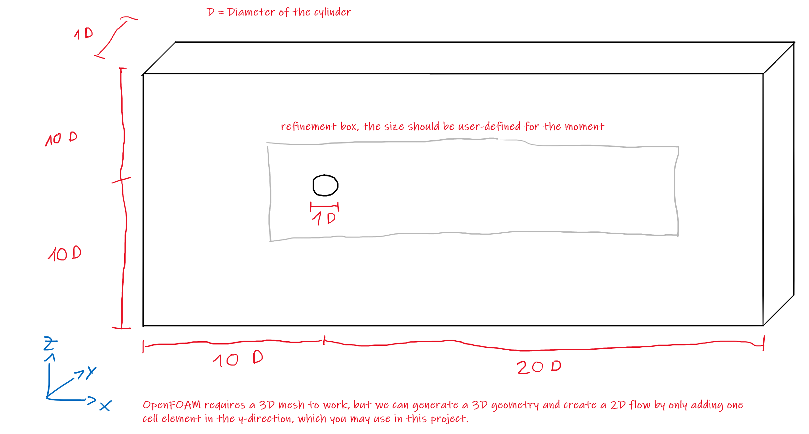
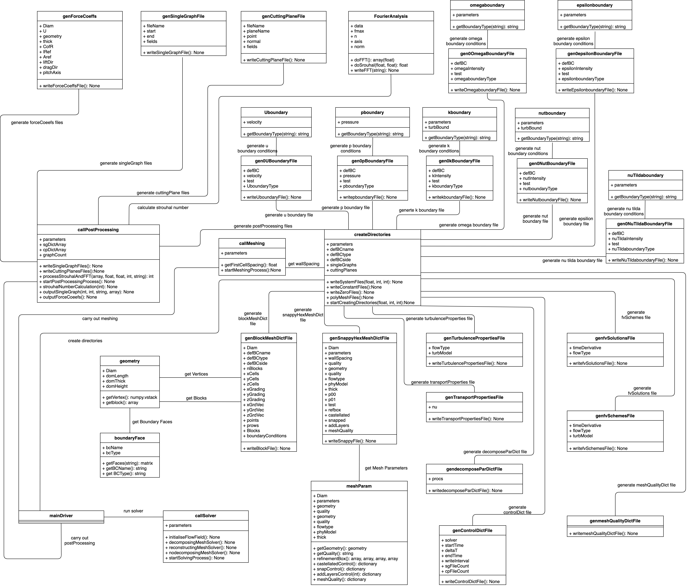

[](https://pypi.python.org/pypi/pygcs/)
[](https://www.python.org/)

# OpenFOAM Automated Tool Chain Proof of Concept (PoC) 
## Introduction
This project is focused on developing a Proof of Concept (PoC) for an automated tool chain to carry out simulations for aerospace applications on OpenFOAM open-source software. The goal is to specify as few parameters as possible and launch a simulation through a series of Python scripts and Unix Shell Bash commands.

For this PoC only external aerodynamics are considered. The case study that will be considered is the flow around a cylindrical geometry. Among the flows specifications that are studied, are a combination of unsteady or steady flows with laminar or turbulent flows. The space resolution, that is if a wall modelled (using wall functions for near wall treatment) or wall resolved (using finer mesh near the walls) approach is also taken into consideration as a user input parameter.

The mesh generation for the external aerodynamics is also carried out through scripts by automatically generating the *blockMeshDict* file where the faces and boundary conditions for the mesh faces will be assigned with very little input from the user based on the domain shown below. 

<!---

-->
<p align="center">

</p>

The snappyHexMesh file will not take Stereolithography *(\*.stl)* files into consideration as handling them are quite complex and also since this project will only look at the flow around a cylinder and therefore the geometry will be defined inside the *snappyHexMeshDict* file itself. The layer thickness is also determined based on the user specifications for the flow, most importantly on whether the user has specified if the space resolution is wall modelled or wall resolved.

In the case of turbulent flows, the turbulence model (RANS/URANS) is specified by the user as one out of Spallart-Allmaras, k-Epsilon, k-Omega and k-Omega SST. Depending on the model that is specified the boundary conditions are generated automatically through the scripts. If the turbulence model is changed then the boundary conditions are changed automatically, without any user intervention by the scripts of the tool chain.

The project will also look into automatically generating the directory structure and files required to set up the solver. Files such as the *transportProperties*, *turbulenceProperties*, *controlDict*, *decomposeParDict*, etc. are generated based on the inputs set by the user. When generating the *fvSchemes* and *fvSolutions* files, several options are investigated to identify which solvers work best for the given scenario.

As the final part for the tool chain the post processing is automated. Generating the files for the Force Coefficients, Single Graphs and Cutting Planes functions that are part of the OpenFOAM environment is automated. Furthermore, the presentation of the post processed results is investigated as part of the tool chain.


## Flow Past Cylinder Test Case
For the purpose of validation of this PoC for an automated simulation environment in OpenFOAM, the flow past a cylinder test case will be used in the context of the external flows. 

The flow past a circular cylinder is historically an important benchmark for the numerical models where the transition from laminar to turbulent separation can be studied in function of the Reynolds number.

The complicated flow structure developing in the wake of a blunt body such a smooth cylinder usually involves boundary layer separation and for certain Reynolds ranges strong flow oscillations.

For Reynolds numbers below the critical value **Re = 4x10^5**, the flow is considered laminar and the separation typically occurs at a sharp corner of the geometry leading to the periodic shedding with defined frequencies, well known as the Von Kármán Vortex Street.

An important validation tool is the Strouhal number, a non-dimensional quantity that takes in account the frequency, in this case of the vortex shedding:

<p align="center">
<a href="https://www.codecogs.com/eqnedit.php?latex=\bg_white&space;St=\frac{f&space;L}{U}" target="_blank"></a>
</p>

Where:
- f is the frequency, 
- L is the characteristic length (the diameter for the cylinder case),
- U is the local velocity.

The flow instabilities are also quantified through the drag and lift coefficients, defined respectively as the following quantities:
<p align="center">
<!---
C_D = D / (1/2 rho_inf U_inf^2 A),

--->
<a href="https://www.codecogs.com/eqnedit.php?latex=\bg_white&space;C_D=\frac{D}{\frac{1}{2}&space;\rho_\infty&space;U^2_\infty&space;A}" target="_blank"></a>
</p>
<p align="center">
&
</p>
<p align="center">
<!---
C_L = L / (1/2 rho_inf U_inf^2 A),

--->
<a href="https://www.codecogs.com/eqnedit.php?latex=\bg_white&space;C_L=\frac{L}{\frac{1}{2}&space;\rho_\infty&space;U^2_\infty&space;A}" target="_blank"></a>
</p>

Where:
- A is the relevant area, 
- D and L are drag and lift forces, 
- rho_inf and U_inf are the freestream density and velocity.


## Reference Literature
The flow past a cylinder test case has a wealth of literature to validate our setup. The laminar 2D/3D flow was validated against the results found in:
- Rajani et al., "Numerical simulation of laminar flow past a circular cylinder", *Applied Mathematical Modelling*, 33(3), 2009 (https://doi.org/10.1016/j.apm.2008.01.017).

And for high Reynolds number against the results found in:
- Schlichting et al., "Boundary-Layer Theory", *Springer-Verlag Berlin Heidelberg*, 2017 (https://doi.org/10.1007/978-3-662-52919-5). 


# Usage
The following setup runs only on Python 3.X release and ESI version of OpenFOAM, where Python 3.6.9 version and OpenFOAM v1912 (using Ubuntu 18.04 LTS) were used for this project.

## Required Libraries & Packages
- Step 1: OpenFOAM source package for the ESI version can be installed (using the full installation guide) and run using Bash on Ubuntu on Windows, usually this utility is referred to as the Windows Subsystem for Linux (WSL) which uses the genuine Ubuntu image provided by Canonical, via the following URL: https://www.openfoam.com/download/openfoam-installation-on-windows-10

- Step 2: Next, to install Python programming language on your Ubuntu or Terminal, first check if you have any Python 3.X release version installed on your machine by typing the following command:
  ```bash
  python --version   # for Python 2.X release version
  python3 --version  # for Python 3.X release version
  ```
  If the release version level is lower than 2.7.X, and if Python 3.X is not installed, continue to the next step. Otherwise, proceed to Step 4.

- Step 3: Next, you have to install the prerequisites supporting software packages, which gives you better control over your package manager by letting you add Personal Package Archive (PPA) repositories, using the command: 
  ```bash
  sudo apt install software-properties-common
  ```
  Now, you have to add the ```deadsnakes``` PPA to your system’s sources list, which is a PPA with newer releases than the default Ubuntu repositories, by using the command:
  ```bash
  sudo add-apt-repository ppa:deadsnakes/ppa
  ``` 
  The system will prompt you to press ```[Enter]``` to continue. 
  Now, update and refresh then upgrade the local package lists from the repositories, using the following commands:
  ```bash
  sudo apt update
  sudo apt upgrade
  ```
  Finally, to install any Python 3.X release version, run the command:
  ```bash
  sudo apt install python3.6  # for Python 3.6.X newest release version
  ```
  Allow the process to complete and verify the Python release version using the command:
  ```bash
  python3 --version  # for Python 3.X release version
  ```

- Step 4: Next, ```NumPy``` library should be installed. ```NumPy``` (Numerical Python) is an open-source library for the Python language. It is used for scientific computing and working with arrays. Apart from its multidimensional array object, it also provides high-level functioning tools for working with arrays. To install this library, ```pip``` package which is a package manager for installing and managing Python software packages should be first installed. The package manager should correspond to the Python release already installed on your machine; therefore, you should run the command:
  ```bash
  sudo apt install python3-pip  # pip package for Python 3.X
  ```
  To install now ```NumPy```, run the command:
  ```bash
  pip3 install numpy
  ```
  To verify the version of ```NumPy``` installed, run the command:
    ```bash
  pip3 show numpy
  ```


## Case-Setup & Case Run
When designing the tool chain, an Object-Oriented Programming (OOP) approach has been used. A class has been created for each of the stages in the simulation process discussed above. In addition to these classes, several other classes have been created in order to modularize the process of carrying out various tasks in the flow of activities of the tool chain. The relationship between these classes is given in the UML diagram seen below.


The launching point for the tool chain is the mainDriver *(Automated_Tool_Chain_mainDriver.py)*. Within this, the input parameters specified by the user in *User_Inputs_Parameters.py* file found inside *src* folder, are adopted for the simulation. The list of parameters are as follows:

- **FOLDER_NAME**: Specify the Case Directory Name.
- **DIAMETER**: Specify the Cylinder Diameter.
- **THICKNESS**: Specify the Cylinder Thickness in z-direction, "THICKNESS = 1" for 2D & "THICKNESS = 4" for 3D.
- **VELOCITY**: Specify the Flow Velocity.
- **REYNOLDS_NUMBER**: Specify the Value of Re Number.
- **DENSITY**: Specify the Flow Density.
- **START_TIME**: Specify the Simulation Start Time.
- **TIME_STEP**: Specify the Simulation Time Step, if "TIME_DERIVATIVE = "steady"" -> TIME_STEP = 1 by default (No need to fill for any value).
- **END_TIME**: Specify the Simulation End Time.
- **WRITE_INTERVAL**: Used to Control the timing of write output to file per every WRITE_INTERVAL time steps.
- **NUMBER_OF_PROCESSORS**: Specify the Number of Processors (CPU), "NUMBER_OF_PROCESSORS = 1" for Serial Run & "NUMBER_OF_PROCESSORS > 1" for Parallel Run.
- **TOPOLOGY**: Specify the Geometrical Topology, "TOPOLOGY = 2D" for 2D Simulation & "TOPOLOGY = 3D" for 3D Simulation.
- **TIME_DERIVATIVE**: Specify the Time Resolution, "TIME_DERIVATIVE = steady" for Steady-State Simulation & "TIME_DERIVATIVE = unsteady" for Transient Simulation.
- **FLOW_TYPE**	: Specify the Flow Type, "FLOW_TYPE = laminar" for laminar flow & "FLOW_TYPE = RAS" for turbulent flow.
- **TURBULENCE_MODEL**: Specify the RANS Turbulence Models, "TURBULENCE_MODEL = SpalartAllmaras _or_ kEpsilon _or_ kOmega _or_ kOmegaSST".
- **PHYSICAL_MODEL**: Specify the Near Wall Modelling, "PHYSICAL_MODEL = wallResolved" for y+ = 1 & "PHYSICAL_MODEL = wallModeled" for y+ >= 30 (i.e., using wall functions).

The mainDriver will also generate a number of additional parameters based on these initial user inputs, which include the y+ value and turbulent quantities among others. Additional advanced parameters required for meshing, solving and post processing are also specified in the mainDriver and can be edited for a specific simulation setup.

The mainDriver then calls instances of the classes ```createDirectories()```, ```callMeshing()```, ```callSolver()``` and ```callPostProcessing()``` to perform the four stages of the tool chain, i.e., creating directories, meshing, solving and post processing. The ```createDirectories()``` class creates the necessary OpenFOAM directories (*0/*, *constant/* and *system/*) for the next stages of the tool chain. The ```callMeshing()```, ```callSolver()``` and ```callPostProcessing()``` classes contain the methods necessary to carry out the next stages of the OpenFOAM pipeline. These classes in turn call several other classes as seen in the UML diagram.

To launch the toolchain, the user should run this one, and only command:
```bash
python3 Automated_Tool_Chain_mainDriver.py
```
And the whole simulation process will take place automatically with some prompted *YES or NO* messages between each stage until reaching the simulation end time.


# License
This software project is provided under the MIT license, see the above accompanying license file.


# Contributors
This project was part of the Master of Science (MSc) degree in [Aerospace Computational Engineering](https://www.cranfield.ac.uk/courses/taught/aerospace-computational-engineering) at [Cranfield Univeristy](https://www.cranfield.ac.uk/) for the academic year 2019/2020, where the main and only contributors are: 
- Vadim Maltsev (Student at Cranfield University UK, GitHub: [@VadimCRN](https://github.com/VadimCRN) & Email: V.Maltsev@cranfield.ac.uk)
- Samali Liyanage (Student at Cranfield University UK, *No GitHub profile* & Email: Samali.Liyanage@cranfield.ac.uk)
- Elias Farah (Student at Cranfield University UK, GitHub: [@Eliasfarah0](https://github.com/Eliasfarah0) & Email: E.Farah@cranfield.ac.uk)

The project was fully conducted under the supervision of:
 - Dr. Tom-Robin Teschner (Lecturer at Cranfield University UK, GitHub: [@tomrobin-teschner](https://github.com/tomrobin-teschner) & Email: Tom.Teschner@cranfield.ac.uk)
